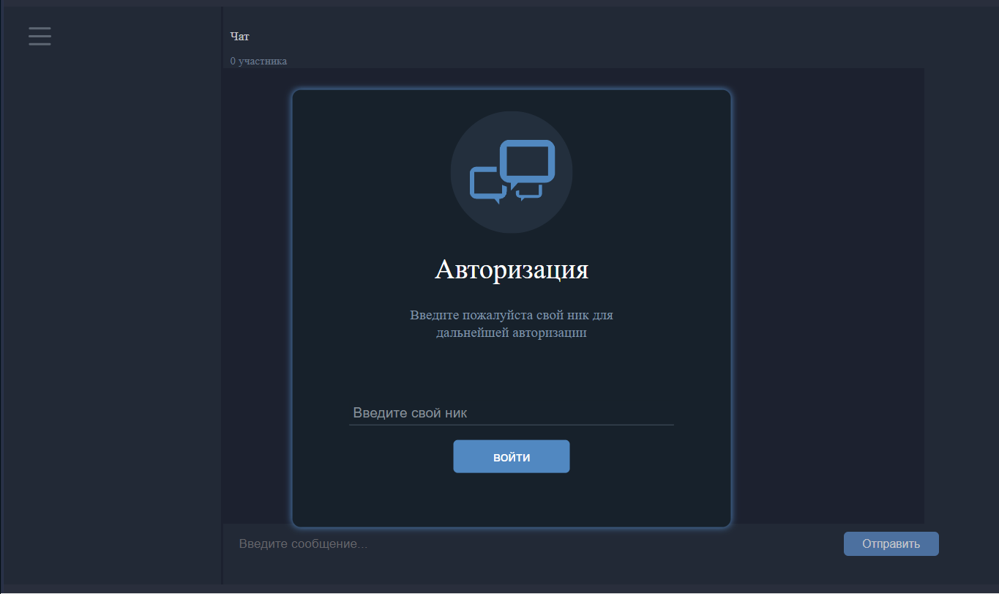
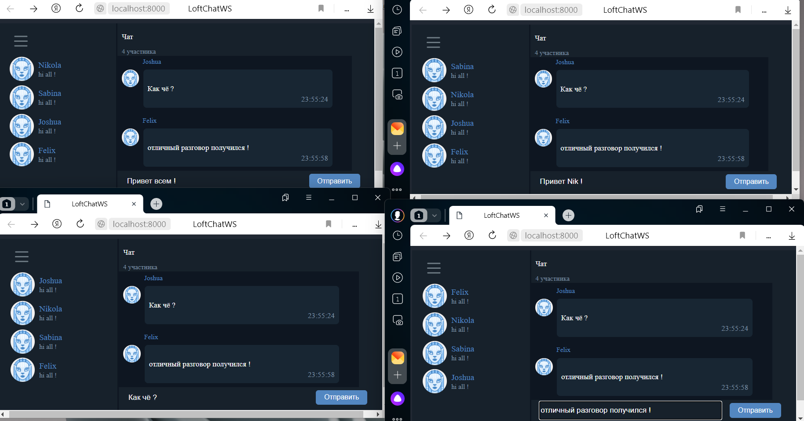
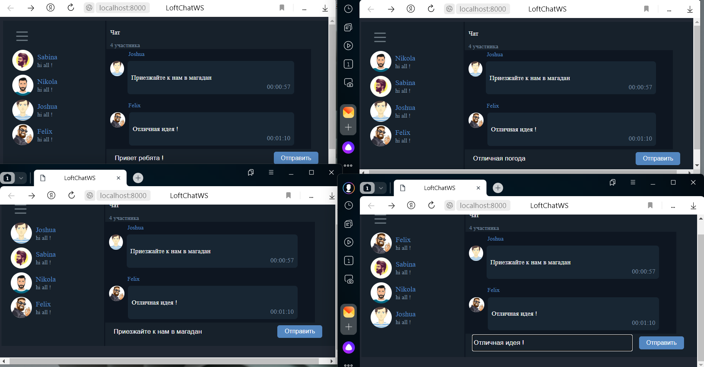
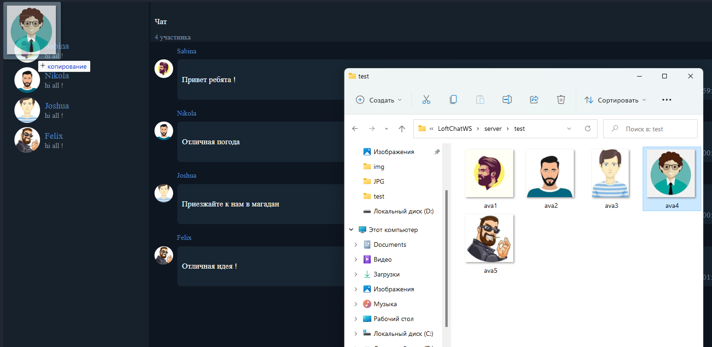
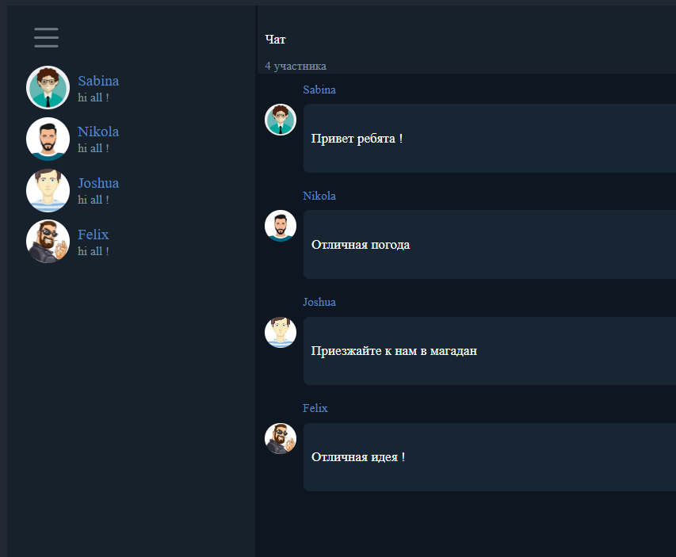

## LoftChatWS-
> Реализация чата на WebSocket API + WebComponent API + Dra And Drop API
> Серверная часть работает на Node.js
 ---
### Как запустить
- npm clone https://github.com/sharp2point/LoftChatWS-
- npm i
- npm run start
- [GO TO] http://localhost:8000/

### Скриншоты

